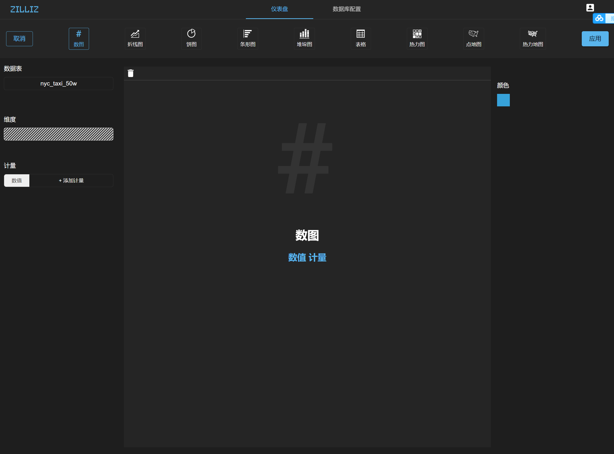

# 实验一：纽约出租车数据分析

## 1、测试数据准备

本实验使用的50万条开放纽约出租车数据，数据下载地址：[https://pan.baidu.com/s/1Njtr1316E25vuLzkB4k6RA](https://pan.baidu.com/s/1Njtr1316E25vuLzkB4k6RA), 建议将数据下载至 `/tmp` 下。

经实测，以下硬件配置可顺利完成实验：

| 组件  | 最低配置                  |
| ---------- | ------------------------------- |
| OS         | Ubuntu LTS 18.04                |
| CPU        | Intel Core i5-8250U             |
| GPU        | NVIDIA GeForce MX150, 2GB GDDR5 |
| GPU 驱动软件 | Driver 430                      |
| 内存     | 8 GB DDR4                       |
| 硬盘    | NVMe SSD 256 GB                 |


## 2、设置 MegaWise 参数

在开始之前，请确保已安装 [MegaWise](https://www.zilliz.com/cn/docs/v0.5.0/install_megawise)，进入自定义 MegaWise 安装目录，以下将以 `/home/$USER/megawise` 目录为例，进入该目录，设置 MegaWise 参数：

1. 打开 `conf` 目录下的 `user_config.yaml` 配置文件，定位到如下片段：

    ```yaml
    memory:
        cpu:
            physical_memory: 16 # size in GB
            partition_memory: 16 # size in GB

        gpu:
            num: 2
            physical_memory: 2 # size in GB
            partition_memory: 2 # size in GB
    ```

> 注意：`cpu` 部分 `physical_memory` 和 `partition_memory` 均设置为服务器共享内存可用容量的70%以上；
>
> `num` 表示当前 MegaWise 使用的 GPU 数量，`physical_memory` 和 `partition_memory` 设置为单张显卡显存容量的值减2。。

2. 打开 `conf` 目录下面的 `megawise_config.yaml` 配置文件，修改如下片段：

    ```yaml
    worker_num : 1
    gpu:
        physical_memory: 2    # unit: GB
        partition_memory: 2   # unit: GB
    cuda_profile_query_cnt: -1 #-1 means don't profile, positive integer means the number of queries to profile, other value invalid
    ```

> 注意：修改 `worker_num` 、`gpu physical_memory` 和 `partition_memory` 等参数，使其与前面 `chewie_main.yaml` 文件中相应的设置保持一致，其中 `worker_num` 与 `gpu_num` 对应。


## 3、启动 MegaWise 并导入测试数据

1. 启动MegaWise之后，可以选择从Docker内部连接MegaWise或者从Docker外部连接MegaWise。

   >注意：如果要使用infini可视化界面，必须从Docker外部连接MegaWise。

   从Docker**内部**连接MegaWise：

   进入MegaWise Docker的bash命令并连接MegaWise数据库：

   ```bash
   $ docker exec -u `id -u` -it $CONTAINER_ID bash
   $ cd script && ./connect.sh
   ```

   如果出现以下信息：

   ```bash
   psql (11.6 (Ubuntu 11.6-1.pgdg18.04+1), server 11.1)
   Type "help" for help.
   
   postgres=#
   ```

   就说明成功连接上MegaWise了。

   

   从Docker**外部**连接MegaWise：

   关闭MegaWise：

   ```bash
   $ docker stop $CONTAINER_ID
   ```

   进入MegaWise的工作目录进行以下修改：

    打开`data`目录下面的`postgresql.conf`配置文件。将`listen_addresses`参数的值设置为`'*'`（注意引号）并取消此行的注释。

   打开`data`目录下面的`pg_hba.conf`配置文件。在`#IPv4 local connections`下方添加如下行：

   ```
   host   all      all     0.0.0.0/0      trust
   ```

   重新启动MegaWise。

   >注意：您不能使用`docker start $CONTAINER_ID`的方式来重新启动MegaWise。

   ```bash
   $ docker run --gpus all --shm-size $SHM_SIZE \
                           -e USER=`id -u` -e GROUP=`id -g` \
                           -v $WORK_DIR/conf:/megawise/conf \
                           -v $WORK_DIR/data:/megawise/data \
                           -v $WORK_DIR/logs:/megawise/logs \
                           -v $WORK_DIR/server_data:/megawise/server_data \
                           -v /home/$USER/.nv:/home/megawise/.nv \
                           -v /tmp:/tmp \
                           -p 5433:5432 \
                           $IMAGE_ID
   ```

   

2. 操作MegaWise。

   ```sql
   $ psql -U $USER_ID -p 5433 -h $IP_ADDR -d postgres
   ```

   > `$USER_ID`可以通过以下命令得到：

   ```bash
   $ id -u
   ```

   `$IP_ADDR`可以通过以下命令得到：

   ```bash
   $ ifconfig
   ```

   如果出现以下信息就说明成功连接上MegaWise：

   ```sql
   psql (11.6 (Ubuntu 11.6-1.pgdg18.04+1), server 11.1)
   Type "help" for help.
   
   postgres=#
   ```

   

3. 创建MegaWise用户并导入测试数据。

   在postgres数据库中创建一个用户。用户名为`zilliz`，密码为`zilliz`。

   ```sql
   postgres=# CREATE USER zilliz WITH PASSWORD 'zilliz';
   postgres=# grant all privileges on database postgres to zilliz;
   ```

​       用户创建完成后，您可以使用创建好的用户向postgres数据库中导入示例数据。

​       获取示例数据：

```bash
$ wget -P /tmp https://raw.githubusercontent.com/zilliztech/infini/v0.5.0/sample_data/nyc_taxi_data.csv
```

​      创建扩展、建表、并导入示例数据：

```sql
postgres=# create extension zdb_fdw;
  postgres=# create table nyc_taxi(
   vendor_id text,
   tpep_pickup_datetime timestamp,
   tpep_dropoff_datetime timestamp,
   passenger_count int,
   trip_distance float,
   pickup_longitute float,
   pickup_latitute float,
   dropoff_longitute float,
   dropoff_latitute float,
   fare_amount float,
   tip_amount float,
   total_amount float
   );
  postgres=# copy nyc_taxi from '/tmp/nyc_taxi_data.csv'
   WITH DELIMITER ',' csv header;
```


## 4、进入 Infini 可视化界面并新建仪表盘

请确保已安装并启动 [Infini 可视化界面](https://www.zilliz.com/cn/docs/v0.5.0/install_infini)，推荐使用 Chrome 和 Firefox 浏览器。

```shell
# 192.168.1.60 是运行 Infini docker 的服务器 IP 地址
http://192.168.1.60
```

1. 进入登录界面。

   

   **输入用户名和密码进行登录：**

   - 用户名: zilliz
   - 密码: zilliz

2. 填写 MegaWise 数据库信息。

   登录后，输入 MegaWise 相关信息，点击保存，界面就会跳转到仪表盘页面。

   > 网址填写运行 MegaWise docker 的服务器 IP 地址。

   

   

3. 新建纽约出租车数据的分析界面。

    1. 单击左上角`新增仪表盘`，修改仪表盘名称为`纽约出租车demo`：

    

    2. 点击 `+ ADD Chart`，出现以下界面：

    

4. 创建纽约出租车点位信息。

    选择点地图，点击数据表的选择框，选择 `nyc_taxi_50w`，在经度添加计量 `dropoff_longitude`，纬度添加计量 `dropoff_latitude`，修改地图名为 `纽约出租车`：

    

    点击右上角`应用`，出现以下界面：

    

   

5. 创建纽约出租车时间轴折线图。

    1. 右上方单机`新增图表`，选择折线图，左侧 X 轴添加维度 `tpep_dropoff_datetime`，分组时选择`天`，Y 轴添加维度 `total_amount`，修改折线图名为 `纽约出租车计量($ USD)`：

        

    2. 点击右上角`应用`，出现以下界面：

        


6. 创建纽约出租车费用计数。

   1. 右上方选择`新增图表`，选择数图，左侧数值添加计量 `total_amount`，后点击求和，在右侧将计量数值格式改为 `Sl 1.2k`，修改数图名为 `出租车费用($ USD)`：

        

   2. 点击右上角`应用`，出现以下界面：

        

   

7. 创建纽约出租车里程计数。

   1. 右上方选择`新增图表`，选择数图，左侧数值添加计量 `trip_distance`，后点击求和，在右侧将计量数值格式改为 `Sl 1.2k`，修改数图名为 `纽约出租车里程(km)`：

        

	2. 点击右上角`应用`，出现以下界面：

        

   

8. 创建纽约出租车市场份额。

   1. 右上方选择`新增图表`，选择饼图，左侧维度添加维度 `vendor_id`，点击计量下方选择框，选择 `passenger_count`，后点击求和，修改饼图名为 `纽约出租车市场份额`：

        

	2. 点击右上角`应用`，出现以下界面：

        
   
   纽约出租车数据分析完成！