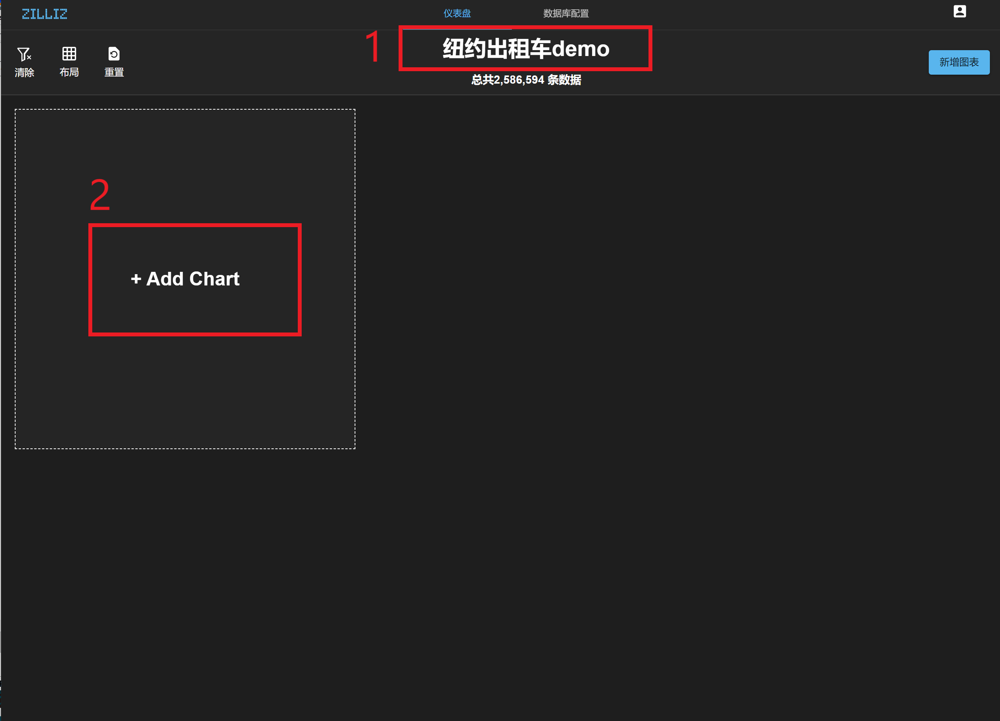
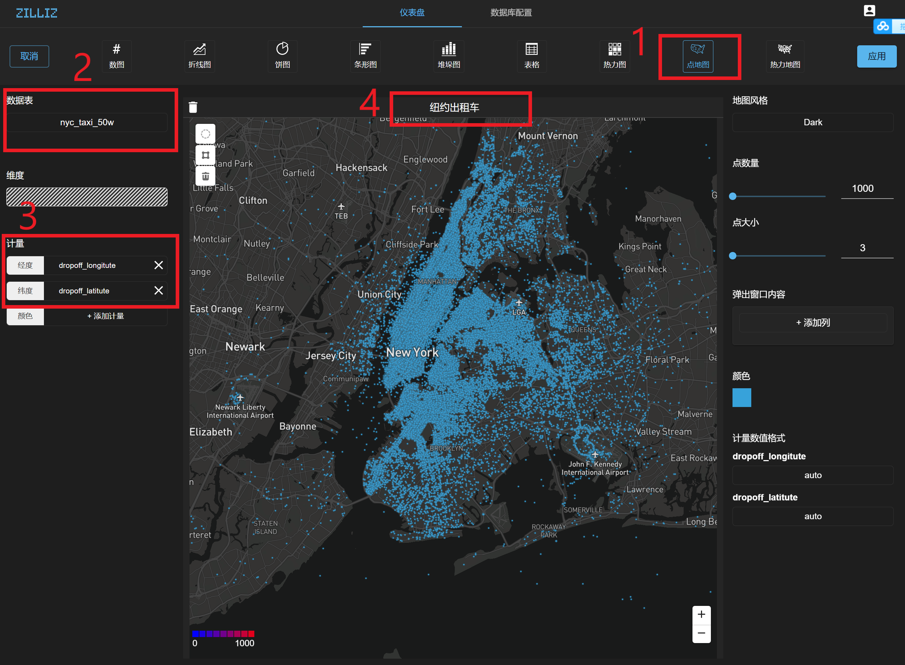
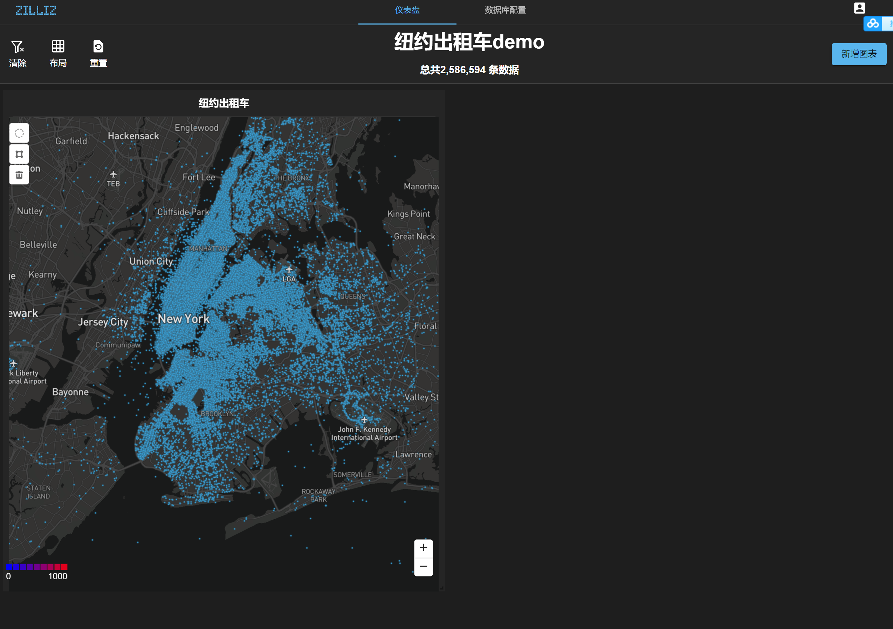
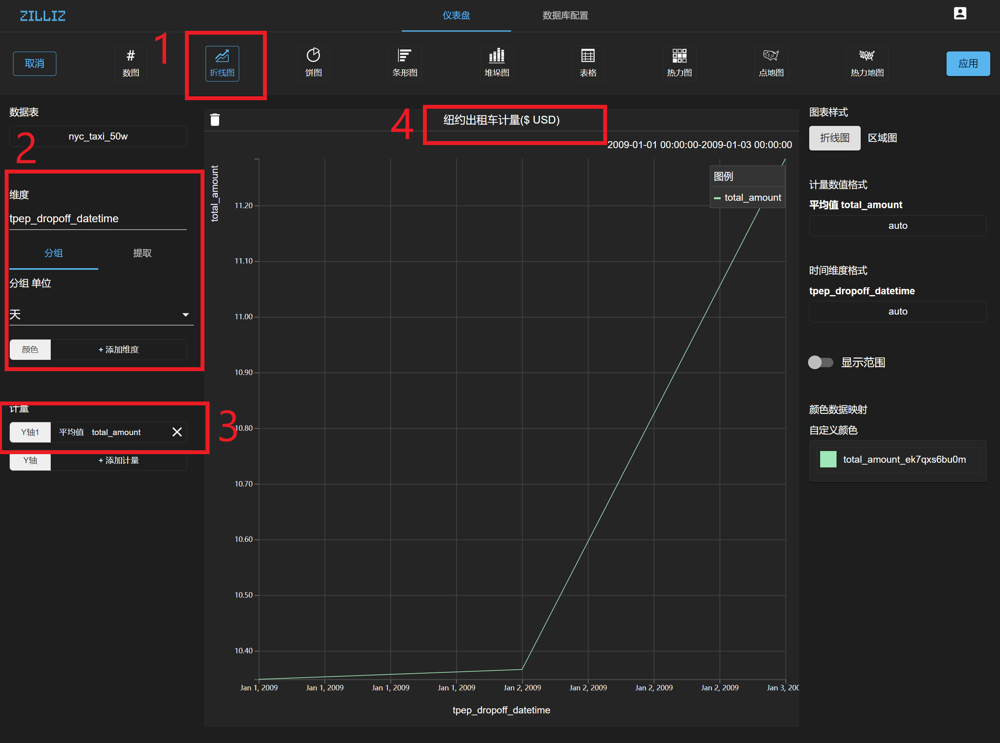
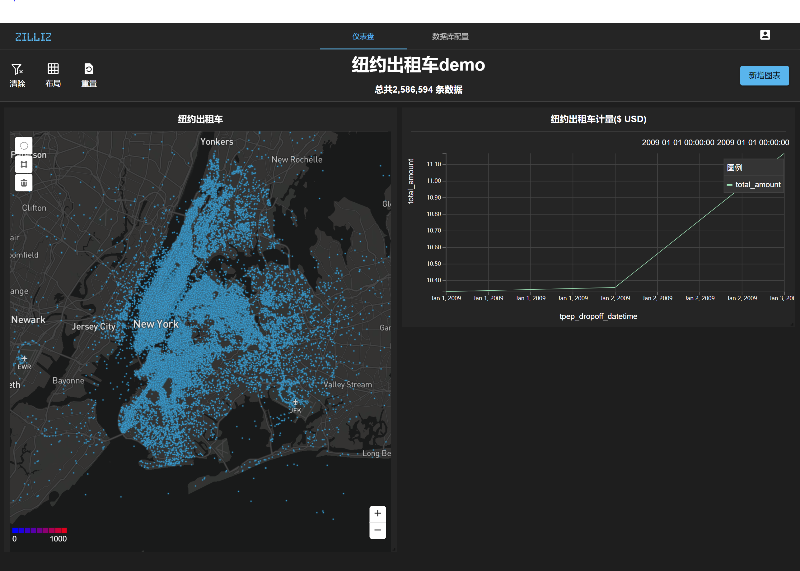
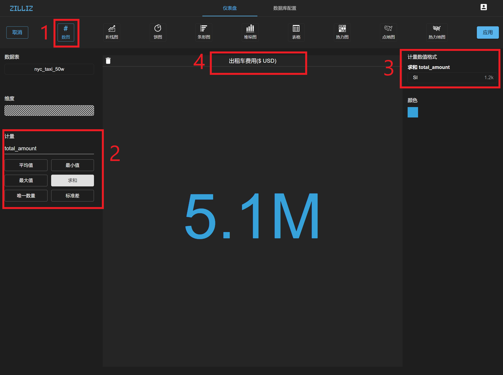
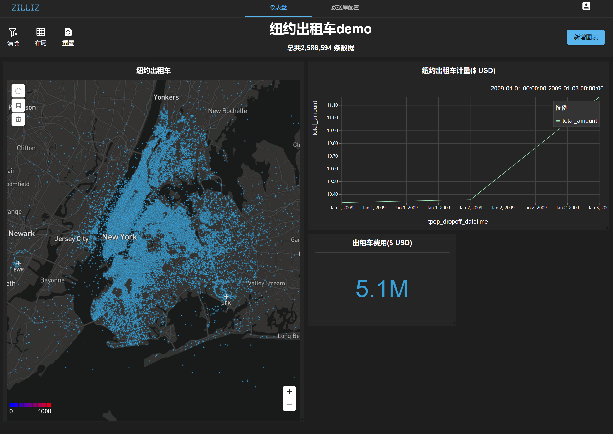
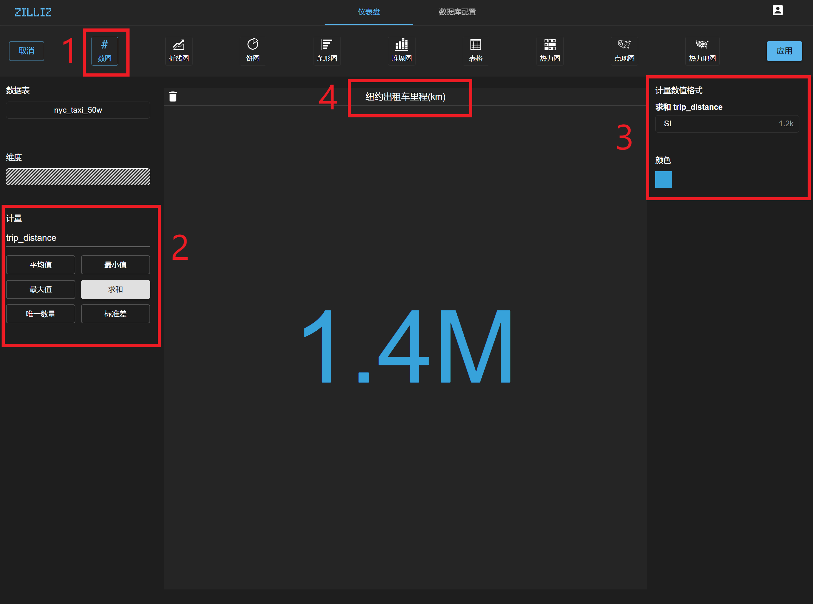
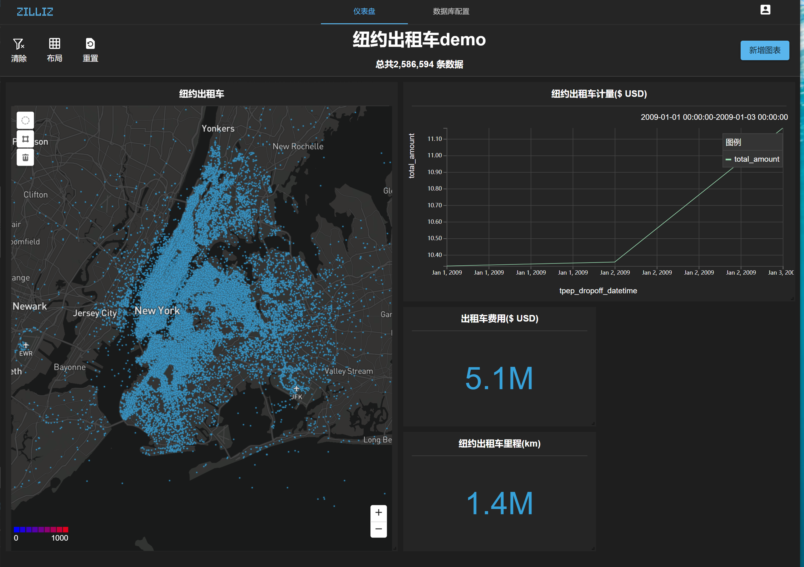
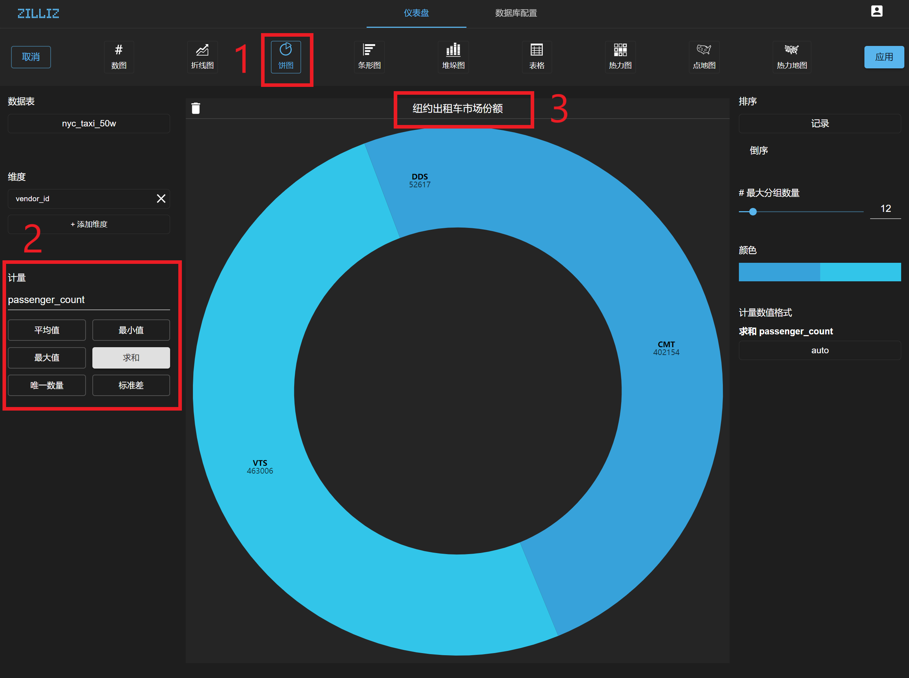

# 实验一：纽约出租车数据分析

## 1、测试数据准备

本实验使用的50万条开放纽约出租车数据，数据下载地址：https://pan.baidu.com/s/1Njtr1316E25vuLzkB4k6RA, 建议将数据下载至/tmp下。

经实测，以下硬件配置可顺利完成实验：

| Component  | Minimum Config                  |
| ---------- | ------------------------------- |
| OS         | Ubuntu LTS 18.04                |
| CPU        | Intel Core i5-8250U             |
| GPU        | Nvidia GeForce MX150, 2GB GDDR5 |
| GPU Driver | Driver 430                      |
| Memory     | 8 GB DDR4                       |
| Storage    | NVMe SSD 256 GB                 |

至此，测试数据已下载至 **/tmp/nyc_taxi_50w.csv**。


## 2、设置MegaWise参数

在开始之前，请确保已安装[MegaWise](https://infini-analytics.github.io/#/install_infini_sql)，进入自定义MegaWise安装目录，以下将以/home/$USER/megawise目录为例，进入该目录，设置MegaWise参数：

- 打开 `conf` 目录下的 `chewie_main.yaml` 配置文件，修改如下片段：

```
cache:  # size in GB
  cpu:
      physical_memory: 16
      partition_memory: 16

  gpu:
      gpu_num: 1
      physical_memory: 2
      partition_memory: 2 
```

> 注意：`cpu` 部分 `physical_memory` 和 `partition_memory` 应小于本机的物理内存大小；
>
> `gpu_num` 应小于服务器上的显卡数量，`physical_memory` 应小于本机中全局内存最小的显卡的全局内存大小。

- 打开 `conf` 目录下面的 `megawise_config.yaml` 配置文件，修改如下片段：

```
worker_num : 1
gpu:
    physical_memory: 2    # unit: GB
    partition_memory: 2   # unit: GB
cuda_profile_query_cnt: -1 #-1 means don't profile, positive integer means the number of querys to profile, other value invalid
```

> 注意：修改 `worker_num` 、`gpu physical_memory` 和 `partition_memory` 等参数，使其与前面 `chewie_main.yaml` 文件中相应的设置保持一致，其中 `worker_num` 与 `gpu_num` 对应。


## 3、启动MegaWise并导入测试数据

1. 查看MegaWise Docker容器，获取CONTAINER ID信息

   ```bash
   $ docker ps 
   CONTAINER ID	IMAGE	COMMAND		CREATED		STATUS		PORTS	 NAMES
   4aed62f7f5f1  a1e52c9d94a3  "/docker-entrypoint.…"   15 hours ago   Up 15 hours 0.0.0.0:5433->5432/tcp   fervent_perlman
   ```

   > 如果 `docker ps` 查看不到MegaWise相关信息，则使用 `docker ps -a`

2. 启动MegaWise Docker容器

   ```bash
   $ docker restart <CONTAINER ID>
   ```

3. 进入MegaWise Docker容器

   ```bash
   $ docker exec -u megawise -it <CONTAINER ID> bash
   megawise@4aed62f7f5f1:/megawise$
   ```

4. 连接数据库

   ```bash
   megawise@4aed62f7f5f1:/megawise$ cd script
   megawise@4aed62f7f5f1:/megawise/script$ ./connect.sh 
   psql (11.1)
   Type "help" for help.
   postgres=# 
   ```

5. 切换用户并导入测试数据

   ```sql
   postgres=# \c - zilliz
   You are now connected to database "postgres" as user "zilliz".
   postgres=> DROP TABLE IF EXISTS nyc_taxi_50w;
   DROP TABLE
   postgres=> CREATE TABLE nyc_taxi_50w(
       vendor_id               TEXT NOT NULL,
       tpep_pickup_datetime    TIMESTAMP NOT NULL,
       tpep_dropoff_datetime   TIMESTAMP NOT NULL,
       passenger_count         INT4 NOT NULL,
       trip_distance           FLOAT8 NOT NULL,
       old_pickup_longitude    FLOAT8 NOT NULL,
       old_pickup_latitude     FLOAT8 NOT NULL,
       dropoff_longitute       FLOAT8 NOT NULL,
       dropoff_latitute        FLOAT8 NOT NULL,
       fare_amount             FLOAT8 NOT NULL,
       tip_amount              FLOAT8 NOT NULL,
       total_amount            FLOAT8 NOT NULL,
       pickup_longitude        FLOAT8 NOT NULL,
       pickup_latitude         FLOAT8 NOT NULL
   );
   
   postgres=> copy nyc_taxi_50w from '/tmp/nyc_taxi_50w.csv' with csv header delimiter ',';
   COPY 500000
   ```

## 4、进入Infini可视化界面并新建仪表盘

请确保已安装并启动[Infini可视化界面](https://infini-analytics.github.io/#/install_infini_bi)，打开任意浏览器，优先支持 Chrome 和 Firefox

```shell
# 192.168.1.60是运行Infini docker 的服务器 ip 地址
http://192.168.1.60
```

1. 进入登录界面

   

   **输入用户名和密码进行登录：**

   - 用户名: zilliz
   - 密码: zilliz

2. 填写MegaWise数据库信息

   登录后，输入MegaWise相关信息，点击保存，界面就会跳转到仪表盘页面

   > 网址填写运行 MegaWise docker 的服务器 ip 地址

   

   

3. 新建纽约出租车数据的分析界面

   单击左上角`新增仪表盘`，修改仪表盘名称`纽约出租车demo`：

   

   点击` +ADD Chart`，出现以下界面：

   

   - **创建纽约出租车点位信息**

   选择点地图，点击数据表的选择框，选择 nyc_taxi_50w ，在经度`添加计量` dropoff_longitude ，纬度`添加计量` dropoff_latitude ，修改地图名为`纽约出租车`：

   

   点击右上角`应用`，出现以下界面：

   

   

   - **创建纽约出租车时间轴折线图**

   右上方单机`新增图表`，选择折线图，左侧 X 轴`添加维度` tpep_dropoff_datetime，分组时选择`天`，Y 轴`添加维度` total_amount ，修改折线图名为`纽约出租车计量($ USD)`：

   

   点击右上角`应用`，出现以下界面：

   

   

   - 创建纽约出租车费用计数

   右上方选择`新增图表`，选择数图，左侧数值`添加计量` total_amount ，后点击求和，在右侧将计量数值格式改为 Sl 1.2k ，修改数图名为`纽约出租车费用($ USD)`：

   

   点击右上角`应用`，出现以下界面：

   

   

   - 创建纽约出租车里程计数

   右上方选择`新增图表`，选择数图，左侧数值`添加计量` trip_distance ，后点击求和，在右侧将计量数值格式改为 Sl 1.2k ，修改数图名为`纽约出租车里程(km)`：

   

	点击右上角`应用`，出现以下界面：

   

   

   - 创建纽约出租车市场份额

   右上方选择`新增图表`，选择饼图，左侧维度`添加维度` vendor_id ，点击计量下方选择框，选择 passenger_count ，后点击求和，修改饼图名为`纽约出租车市场份额`：

   

	点击右上角`应用`，出现以下界面：

   
   
   最终，纽约出租车数据分析完成！